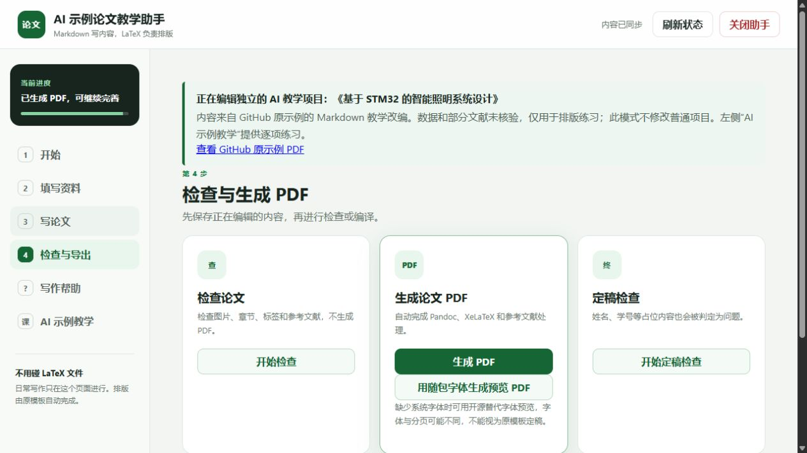
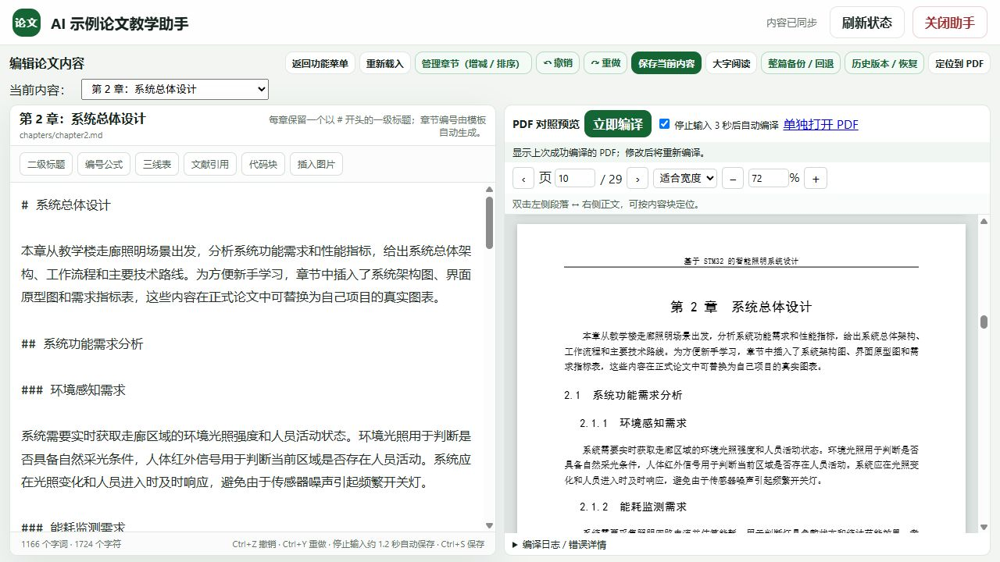
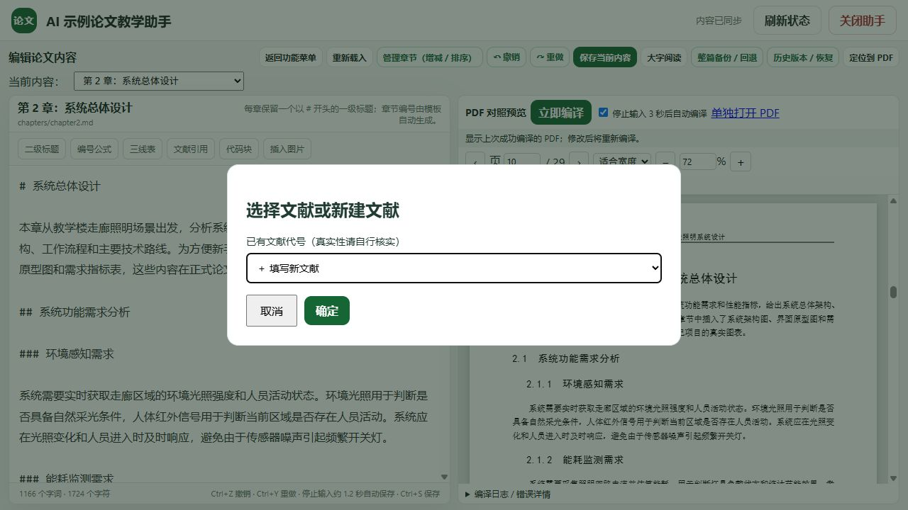
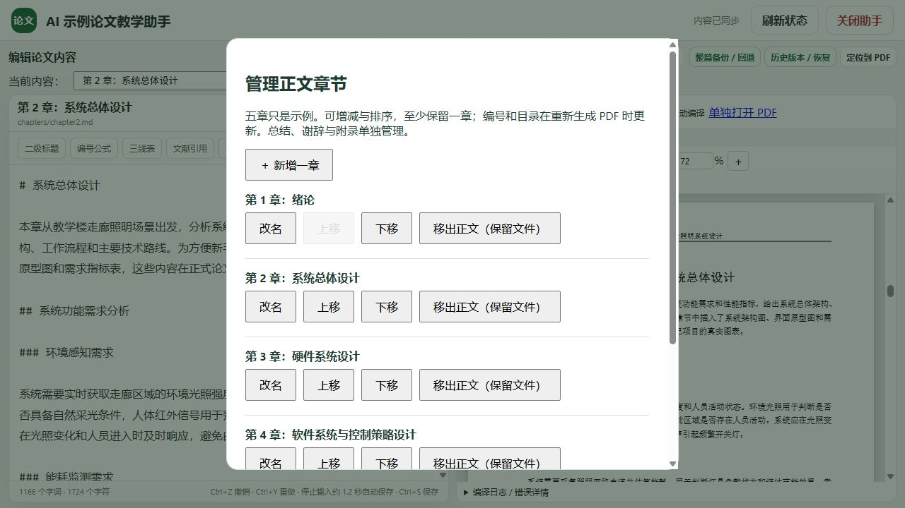
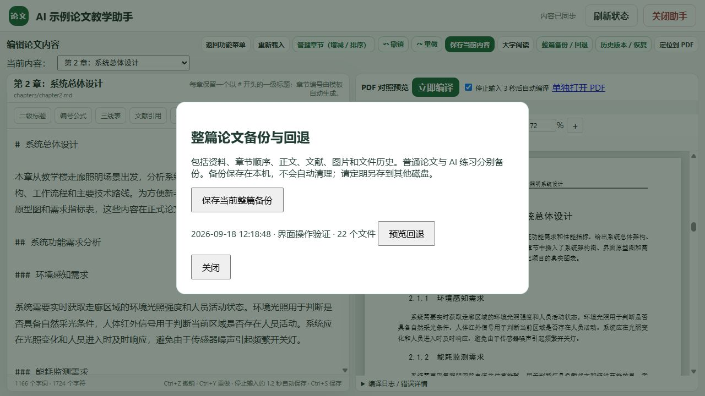

# 跟着一篇示例论文，学会从编辑到导出

v0.6 可直接运行“启动论文助手.bat”，在首页“新建 / 打开论文”中新建 AI 教学练习。以下练习步骤仍适用，旧截图中的布局可能略有不同；新增项目管理和插入预览见 [v0.6 图文指南](UPGRADE_0_6.md)。

这份练习使用《基于 STM32 的智能照明系统设计》。你不需要了解 STM32，也能跟着练习封面、文字、图片和参考文献的排版。每次只改一处，观察 PDF 怎样变化；一旦出错，也更容易找到原因。

本页中的姓名、学号、测试数据和图表均属于示例。练习只用于学习软件操作，不能把模拟结论当作真实研究结果。文献真实性、硬件代码能否运行，也不在排版编译的验证范围内。

[返回项目首页](../README.md) · [下载完整运行包](https://github.com/Kayvion-Hong/xit-markdown-thesis-assistant/releases/download/v0.6.0/xit-v0.6.0-beginner-windows.zip) · [遇到错误时查看这里](TROUBLESHOOTING.md)

## 开始前，打开教学项目

完整解压后双击 `启动AI示例教学.bat`，确认页眉显示“AI 示例论文教学助手”。使用期间保持启动窗口打开。


普通入口是 `启动论文助手.bat`，两种入口编辑不同目录。本次使用教学入口，不要把练习内容粘贴到已经写好的正式论文里。


点击左侧“AI 示例教学”，可从九项教学卡片进入相应页面。也可以直接用“填写资料”“写论文”和“检查与导出”导航。下面另外补充了对照定位、备份恢复以及转入正式写作的练习。

## 练习一：生成第一份 PDF

1. 保持示例文字和资料不变，点击“4 检查与导出”。
2. 点击“生成 PDF”，等待当前任务结束，不要连续重复点击。
3. 成功后点击“打开生成的 PDF”。
4. 找到封面、中英文摘要、目录、正文、参考文献和附录。



完成标准是能打开 PDF 并找到上述部分。不要以“必须和截图一样多页”判断成功，因为字体、环境和后续修改都可能改变分页。

如果失败，先看页面提供的首个具体错误。缺少程序时回开始页刷新环境检查；缺少字体时可以先使用随包字体预览。替代字体的结果仍需在定稿前按学校要求复核。

## 练习二：把封面姓名改成“练习学生”

1. 点击“2 填写资料”，找到姓名字段。
2. 将“张三”改为“练习学生”，其他字段先不动。
3. 点击“保存基本资料”，确认页眉显示“内容已同步”。
4. 返回“检查与导出”，重新生成 PDF 并打开封面。


封面应显示“练习学生”，题目仍是原题目。若仍看到“张三”，先确认此次编译成功，再刷新已打开的 PDF 标签页。练习后可改回“张三”，或者保留为练习记录；普通项目的资料不受影响。

## 练习三：增加一段正文，再试一次撤销

进入“3 写论文”，在“当前内容”中选择“第 1 章：绪论”。找到第一段完整正文的末尾，空一行后输入：

```markdown
这是一段用于学习排版的练习文字。

本次练习重点检查 **保存与预览** 是否正常。
```

按 `Ctrl+S`，等待同步。自动编译开启时，停止输入后会启动编译；没有开启时点击“立即编译”。在 PDF 中找到新增段落，检查“保存与预览”是否加粗。

用 `Ctrl+Z` 撤销，再用 `Ctrl+Y` 或 `Ctrl+Shift+Z` 恢复。一次撤销可能合并一段连续输入，不一定只撤回一个字符，操作后先看左侧内容。如果已做很多其他修改，想找回较早版本，请用“历史版本 / 恢复”，先核对文件名和预览。

## 练习四：左右对照，找到需要修改的段落

选择“第 2 章：系统总体设计”，成功编译一次。



1. 双击左侧“系统功能需求分析”附近的一段正文，观察右侧是否定位到对应内容块。也可放置光标后点“定位到 PDF”。
2. 双击右侧 PDF 的正文段落，观察左侧是否切换到对应源内容。
3. 在 PDF 区域滚动查看下一页，试选“适合整页”，再切回“适合宽度”。
4. 在页码框输入一个已存在的 PDF 页序号后按回车。

右侧页序号包括封面等页面，与正文页脚页码可能不同。定位按内容块工作，封面、目录、自动文献列表和部分自定义 LaTeX 不一定有对应位置。刚改完还未编译时，先生成最新 PDF 再试。

## 练习五：修改图题，认清路径与标签

仍在第二章，找到这段现有图片写法：

```markdown
{#fig:ui-mockup width=92%}
```

只把方括号里的图题改为“监测界面原型图（教学练习）”，保留路径和标签。保存并编译，检查图下标题是否更新。

| 部分 | 作用 |
| --- | --- |
| `![图题]` | 图片说明文字 |
| `(figures/fig_ui_mockup.png)` | 图片文件的位置 |
| `{#fig:ui-mockup width=92%}` | 引用标签及显示宽度 |
| `[图](#fig:ui-mockup)` | 正文中对这张图的引用 |

想新增图片时，在空行点击“插入图片”，选择本机图片并填写图题。它会增加一个对象，不会自动替换原图。图片可能因版面安排浮动到相邻页，先通过图题和引用确认它是否出现。

若报“图片不存在”，检查路径拼写，或重新通过图片按钮选择文件。图题写错通常只需修改文字，不必重新上传图片。

## 练习六：从 Excel 插入一张三线表

在 Excel 的 A1:B3 填写以下内容，数字仅用于练习：

| 次数 | 读数 |
| --- | --- |
| 1 | 10 |
| 2 | 12 |

1. 选中 A1:B3 的完整矩形区域并复制。
2. 在第二章末尾的完整段落后留一行，放置光标。
3. 点击“三线表”，标题填“练习测量记录”，将 Excel 内容粘贴到数据框。
4. 点击“确定”，保留生成的标签和随附引用，保存并编译。

没有 Excel 时，也可在 Markdown 编辑区的空行粘贴以下内容练习一次；再次插入前需更换标签，避免重复：

```markdown
| 次数 | 读数 |
| --- | --- |
| 1 | 10 |
| 2 | 12 |

: 练习测量记录 {#tab:practice-readings}

如[表](#tab:practice-readings)所示。
```

核对 PDF 中的表题、两列数据和引用编号。表格窗口要求至少两行两列，各行列数一致；从 Excel 复制会保留列间制表符，不要手动用空格分列。长文字超宽时，先缩短单元格内容或重新组织表格。

## 练习七：插入一个带编号的公式

选择第三章，在正文后的空行点击“编号公式”。使用默认的 `y = ax + b`，输入框内不用再写 `$$`。确定后，助手会插入公式块及引用句。

把引用句中的省略号换成“这是用于学习编号的示例表达式”，保留标签和链接。保存编译后应看到公式编号，正文引用不应显示问号。

这个表达式仅用于练习，不代表照明系统的实际算法。若复杂表达式报错，先撤销或通过历史恢复，再从简单表达式逐步增加内容。

## 练习八：在正文中引用一条文献

回到绪论，将光标放在某个句子末尾，点击“文献引用”。



选择一条已有文献，再点“确定”。正文会插入 `[@代号]`。保存并完整编译后，检查正文编号及论文末尾的对应条目。

有真实文献时，选择“＋ 填写新文献”并按来源填写；或选择“＋ 导入 BibTeX 文件”，导入 `.bib` 后再选条目引用。文献窗口不会核验论文真假，也不会判断文献是否支持这句话。

提示重复代号时，先核对是否已导入同一条。修改代号时要同步正文引用。原库中的 `liu2024-campuslight` 含“某某大学”占位内容，只能用于练习；其他条目正式使用前也需核验。

## 练习九：加一章，移出，再恢复

先保存，并在“整篇备份 / 回退”里留一份备份。打开“管理章节（增减 / 排序）”。



1. 点击“＋ 新增一章”，填写“拓展实验”，不用写“第六章”。
2. 点击“完成”，切换到新章，在标题下写一句练习正文。
3. 保存并编译，确认目录新增章节。
4. 再开章节管理，将新章上移一次，重新编译检查顺序和编号。
5. 点击该章的“移出正文（保留文件）”，随后从移出列表恢复到正文末尾。

每次结构修改后都重新编译，才能看到目录变化。至少保留一章。正文中“全文共分为五章”等表述和对移出图表的引用，需要自己调整。

## 练习十：备份与文件恢复



在“整篇备份 / 回退”中点击“保存当前整篇备份”，按提示命名为“练习前”。列表出现备份后，再去绪论末尾加一句“这句话用来练习恢复”，保存。

点“历史版本 / 恢复”，选择绪论和新增这句话之前的版本，查看预览。确认是自己要恢复的内容后再执行。回到编辑区检查练习句是否消失，再编译核对 PDF。

整篇回退与单文件恢复范围不同。整篇回退包含资料、章节顺序、正文、文献和图片。练习时先阅读“预览回退”的影响范围，再确认。备份仍在本机，应定期另存到其他磁盘；正常退出前先确认“内容已同步”。

## 再核对一次模拟数字和代码附录

第五章的能耗示例为 12.6 kWh 和 7.4 kWh。计算 `(12.6 - 7.4) / 12.6 × 100%`，约得 41.3%。这只检查算术关系，不能证明真实节能效果。修改表格数字时还要核对正文和图片，图片曲线不会自动重画。

附录一有 C 代码排版示例。先只修改代码块外的一句说明，保留代码块两端的三个反引号，编译查看变化。第五章保留的 AdamW 多行公式也仅用于排版练习，与照明控制算法无关。能排出这些内容，不意味着硬件代码或算法经过实验验证。

## 完成练习后，开始自己的论文

- [ ] 从正确入口打开教学项目并生成 PDF。
- [ ] 修改封面、段落和加粗文字，找到 PDF 中的变化。
- [ ] 插入表格或公式，检查引用编号。
- [ ] 增减章节并更新目录。
- [ ] 保存备份，预览并恢复文件历史。
- [ ] 区分真实研究材料与 AI 排版示例。

点击“关闭助手”，再双击 `启动论文助手.bat`。先填写自己的资料和章节结构，逐步写入真实内容。保留教学项目作查阅示例，不要将未经核验的示例结论当作研究成果。

来源、原始材料位置和转换细节见 [AI 示例教学手册](../AI示例教学手册.md)。日常操作可查阅[新手图文指南](GETTING_STARTED.md)。
