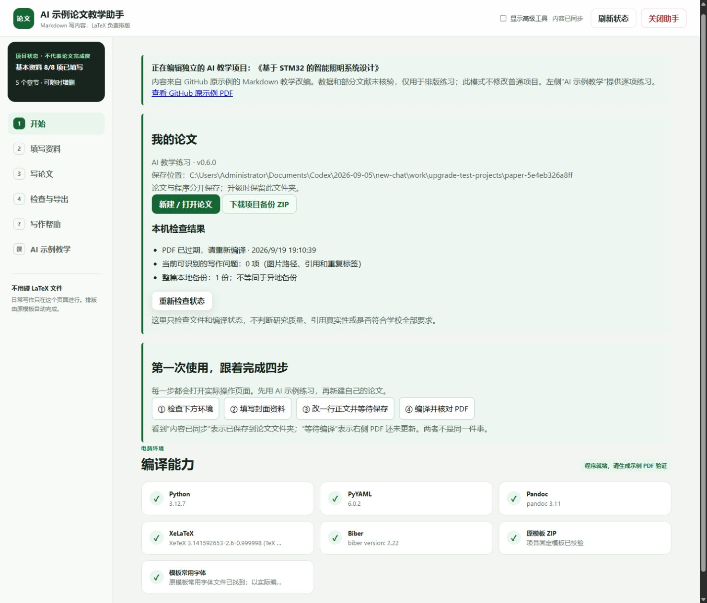
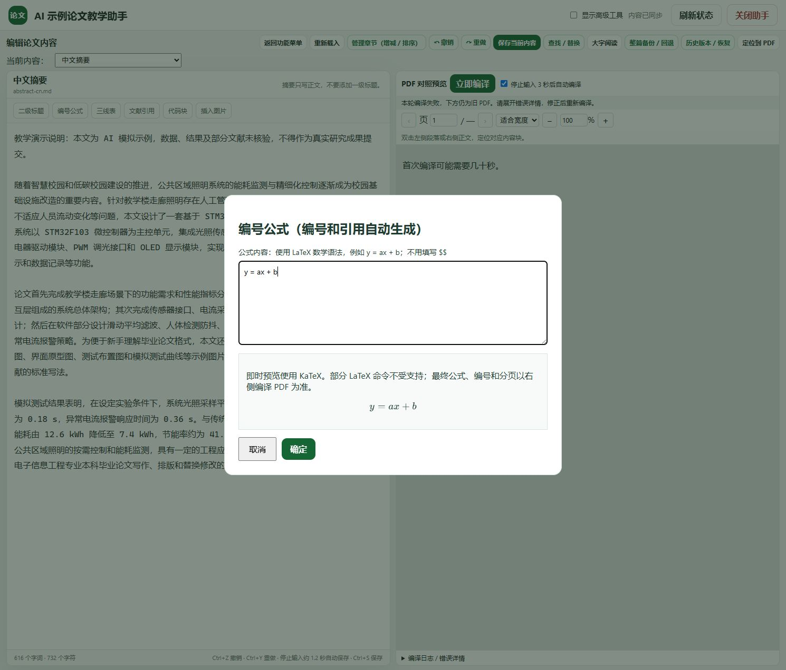
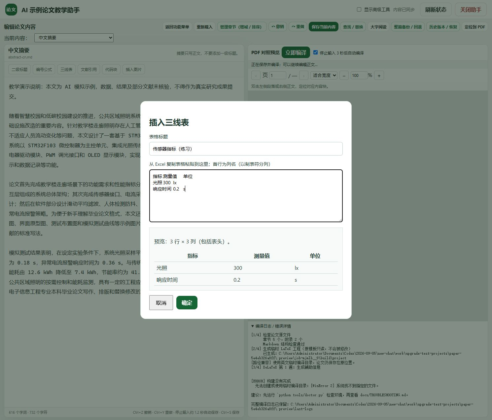

# v0.6：先把论文保存好，再开始写作

这一版主要解决新手容易遇到的三件事：不知道论文存在哪里、分不清保存与编译、插入公式和表格前看不到效果。原有的撤销、自动保存、历史版本和左右 PDF 对照仍然保留。

## 第一次打开

1. 下载 Windows 完整包，全部解压到短路径，例如 `D:\XIT`。
2. 双击 **启动论文助手.bat**。以后日常使用这一个入口即可；旧的 AI 启动文件保留兼容。
3. 首页点击 **新建 / 打开论文 → 新建 AI 教学练习**，给练习起个名字。
4. 根据四步向导检查环境、填写资料、修改一行正文，再到写作页面点击 **立即编译**。
5. 确认右侧出现新 PDF 后，回首页新建自己的论文。AI 示例数据和文献只作排版练习，不能直接当作研究成果提交。



首页的“基本资料 8/8”仅表示八个字段看起来已经填写，不代表论文完成。结构检查也不能验证学术质量、文献真实性或学校全部格式要求。

## 论文到底保存在哪里

默认位置是当前用户的 `Documents\XIT论文\paper-…`。首页会显示本机实际的完整路径。每个项目独立保存：

```text
paper-…/
├── project.yaml      项目名称、格式版本和模板校验值
├── template.zip      创建项目时固定保存的排版模板
├── thesis/           资料、正文、图片、文献和文件历史
├── backups/          整篇备份
├── build/            导出的 PDF 与编译记录
└── .preview/         最近一次成功的对照预览
```

升级时将新程序解压到另一个文件夹即可，**不要删除论文目录**。默认入口会继续打开原来的默认项目，其他论文可从“新建 / 打开论文”选择。模板文件被改动时，程序会停止并提示恢复，不会偷偷替换。

固定模板不代表所有版本的排版都绝对相同：转换程序、TeX 宏包和字体也可能影响结果。正式定稿建议同时保留程序版本、项目 ZIP 和最终 PDF。

## 已经在 v0.5 写过论文

1. 先在旧版打开原论文，恢复可能存在的浏览器草稿，按 **Ctrl+S**，等到“内容已同步”。
2. 保留旧文件夹，打开 v0.6。
3. 首页点击 **新建 / 打开论文 → 导入旧版 0.5 论文**。
4. 粘贴旧版 `XIT` 文件夹的完整路径。这个文件夹应同时含有 `markdown` 和原模板 ZIP。
5. 新版会复制普通论文及模板到独立项目，然后打开新副本。核对题目、章节、图片和文献，再生成 PDF。

此入口导入旧版普通论文。旧浏览器内尚未保存的草稿、旧的整篇备份目录不会自动迁移；原目录保留供核对。已有新格式项目可以直接选择“打开其他论文文件夹”。

## 保存、预览和定稿，分别看什么

| 看到的提示 | 含义与下一步 |
| --- | --- |
| 内容已同步 | 当前编辑内容已写入项目文件，不代表 PDF 已更新 |
| 内容已修改，等待保存和编译 | 稍等，或按 Ctrl+S 后点立即编译 |
| PDF 对应已保存内容 | 最近成功预览的源文件校验值与当前文件一致 |
| PDF 已过期 | 正文、资料、图片或文献发生了变化，需要重新编译 |
| 本轮编译失败，下方仍为旧 PDF | 不要把旧 PDF 当作本次结果；查看错误详情后修正 |
| 使用替代字体 | 可检查内容，但字体和分页可能与原模板不同 |

关闭网页再打开，程序仍会检查上次预览是否过期。它不会只根据“曾经生成过 PDF”就显示完成。

**检查并导出定稿 PDF**会要求原模板常用字体文件存在，并执行严格结构检查和完整编译。这个按钮不能代替人工检查；仍需逐页核对封面、字体、分页、图表、引用与学校当年的要求。

## 插入前先看一眼

### 公式

点击“编号公式”，输入 `y = ax + b`，或者 `\frac{a}{b}`。窗口下方即时显示公式；输入有误或命令不受支持时会说明原因。



公式预览组件随包附带，运行时不需要联网。它使用 KaTeX，与最终 XeLaTeX 不是同一个排版引擎；编号、复杂命令和最终效果以 PDF 为准。即使无法即时预览，仍可插入后尝试完整编译。[KaTeX 使用说明](https://katex.org/docs/api.html)

### 表格

在 Excel 中复制包含表头的区域，粘贴进“三线表”窗口。先看行列是否正确，再点确定。每行列数不一致会阻止插入；列数多或文字较长时会提醒检查超宽。



表格提示是简单启发式检查，不能保证最终不超宽。长表应在 PDF 中逐页检查。

### 图片

选择 PNG/JPEG 后可先看缩略图、像素尺寸和文件大小，再填写图题。取消窗口不会上传图片。低像素提醒按较宽的论文插图估算，并不读取或保证真实打印 DPI；最终清晰度需人工确认。PDF 图片暂不在插入窗口渲染。

## 找字、改字和撤销

在编辑区按 **Ctrl+F**，或点“查找 / 替换”。输入要找的文字，可查找下一处、替换选中项或全部替换。当前版本按原文精确匹配、区分大小写，只处理当前文件。

改错了，关闭查找窗口后按 **Ctrl+Z**；用 **Ctrl+Y / Ctrl+Shift+Z**重做。切换文件不等于丢失已保存内容。较长的选择列表（包括文献列表）提供标题或代号筛选框。

## 备份应该怎么做

每个独立项目在每天第一次启动时保存一份整篇备份。持续开着程序跨天不会自动新增当日备份。写大段内容前，也可在编辑区点“整篇备份 / 回退”手动创建。

首页的 **下载项目备份 ZIP**包含项目配置、固定模板、论文、图片、文献和文件历史，不含运行环境、生成 PDF 或整篇备份目录。请把它另存到其他磁盘或可信云盘；同一磁盘里的自动备份无法防止硬盘损坏。

恢复方法：将 ZIP 解压到新文件夹，在助手里选择“打开其他论文文件夹”，填入包含 `project.yaml` 的 `XIT-project` 文件夹路径。旧论文继续保留，核对无误后再使用恢复副本。

## 当前还没有实现的内容

这一版不是附件中全部长期路线图的完成版。CodeMirror 语法高亮与括号补全、DOI 在线检索、Zotero 集成、文献去重审查、跨磁盘定时备份、逐项图文差异恢复和官方年度模板管理尚未实现。编辑仍以 Markdown 为主；现有状态检查不能代替学术审查，也不承诺永不丢数据。
